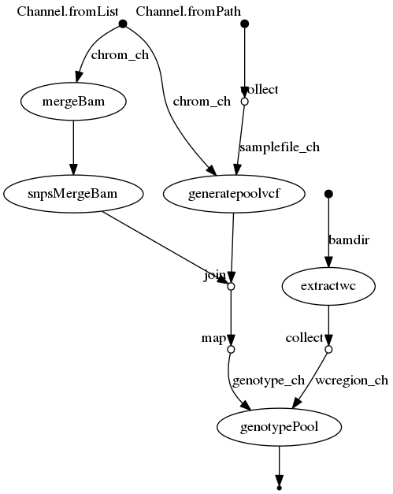

# genotypePool

## Overview
The main inputs to the genotypePool nextflow pipelines are:
1. A directoy of good quality strand-seq BAM files.  
2. A file with a list of sample names contained within the pool, one sample per line. This is used to subset and query the 1KG VCF file. 
3. A directory with 1KG VCF files, separated by chromosomes. Each file must include their chromosome name in "chr?" manner. 
4. A fasta file of the reference genome.

### FlowChart
1. WC regions of each single cell Strand-Seq library is determined and extracted by breakpointR.
2. Using the sample list provided, each 1KG VCF is subset and output into a **poolvcf** directory.
3. All single cell strand-seq libraries are merged and SNPs are extracted.
4. Using **genotypeStrandScells from StrandPhaseR**, extracted SNP positions are used to commpare single cells to 1KG VCF for every provided sample.
5. Assignment of single cell to a single sample based on highest concordance based on all chromsomes tested.

### Outputs
- **countCellLines.txt**
- **scCellLines.txt**
- **readsCellLineAssign.tsv**
- **snpsCellLineAssign.tsv**

<br>




## SetUp
The singularity containers required for the pipeline can be build using image files located in ```deffile```.
```
cd genotypePool/singularity

singularity build bcftools.sif deffile/bcftools.def
singularity build bowtie2_samtools_bedtools.sif deffile/bowtie2_samtools_bedtools.def
singularity build py310_viz.sif deffile/py310_viz.def
singularity build strandseq_Rtools.sif deffile/strandseq_Rtools.def
```

## Running Pipeline
```
nextflow wf_genotypepool.nf --paired <true/false> --bamdir <...> --samplefile <...> --ref <...> --refvcfdir <...>
```
### Required Inputs:
||  |
|:-|:---------|
| ```--bamdir``` |  Path to BAM directory. (directory with individual good quality Strand-seq BAM files to be genotyped) |
| ```--samplefile``` | Path to sample file. (Text file with list of samples in the pool, separated by lines) |
| ```--paired``` | Paired end reads (true/false).|
| ```--ref``` | Path to reference genome fasta. |
| ```--refvcfdir``` | Path to directory holding 1KG vcfs, separated by chromosomes. |
| | |

### Optional:
||  |
|:-|:---------|
| ```--outdir``` |  Path to output directory. |
| ```--poolvcfdir``` | Path to directory holding pool vcf.|
| ```--chromosomes``` | Comma-separated list of chromosomes. |
| ```--threads``` | Number of threads. |
| | |


